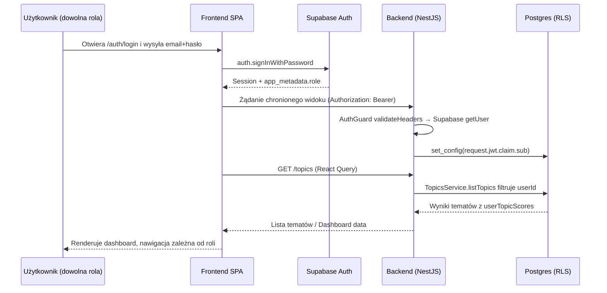

# Ścieżki użytkownika względem ról

## Podsumowanie
Analiza objęła frontend (React + Supabase Auth) oraz backend (NestJS + Prisma) w repozytorium Board Member Assistant. Opisano kompletne ścieżki od logowania po kluczowe zadania dla ról `BOARD_MEMBER`, `ADMIN` oraz `SECURITY_OFFICER`. Uwzględniono komponenty UI, wywoływane endpointy API, logikę serwerową i mechanizmy autoryzacji. Wskazano również luki funkcjonalne i ryzyka bezpieczeństwa wynikające z niespójności ról. Plik `CLAUDE.md`, do którego nawiązuje prompt, nie istnieje w repozytorium – zalecane jest jego przygotowanie, aby utrwalić konwencje pracy z Claude.

## Role i przepływy

### BOARD_MEMBER
| Krok | Cel | Widok/UI | API / Logika | Ryzyka / Notatki |
| --- | --- | --- | --- | --- |
| 1 | Uwierzytelnienie | `LoginPage` przekierowuje po roli Supabase (`/` dla członka zarządu) | Supabase Auth `signInWithPassword`; brak backendu w tym etapie | Błędne dane → toast błędu, brak limitów prób logowania |
| 2 | Dostęp do chronionych widoków | `ProtectedRoute` sprawdza sesję, `AppLayout` buduje menu | Globalny `AuthGuard` waliduje nagłówek Authorization w backendzie | Brak SSR ładowania roli → krótka migawka zanim nawigacja ukryje sekcję admin |
| 3 | Przegląd tygodnia | `DashboardPage` auto-uruchamia zapytanie asystenta i listę tematów | `POST /assistant/query`, `GET /topics` → `TopicsService` filtruje po `userId` | Brak obsługi błędów API w UI (tylko placeholder) |
| 4 | Interakcja z asystentem | `ChatPage` (mutacja `useAssistantQuery`) + feedback | `POST /assistant/query`, `POST /assistant/feedback` aktualizuje `UserQueryLog`, `UserTopicScore` | Brak throttle → możliwość masowych zapytań |
| 5 | Analiza tematów | `TopicsPage` pobiera listę i szczegóły wybranego tematu | `GET /topics`, `GET /topics/:id` – RLS wymusza filtr usera | Brak paginacji; UI nie sygnalizuje ładowania szczegółów |
| 6 | Personalizacja profilu | `ProfilePage` formularz preferencji | `GET /profiles/me`, `PUT /profiles/me` | Walidacja backendowa wymaga pełnych list – UI nadpisuje całe pola, co może wyczyścić dane przy pustych wejściach |

### ADMIN
| Krok | Cel | Widok/UI | API / Logika | Ryzyka / Notatki |
| --- | --- | --- | --- | --- |
| 1 | Uwierzytelnienie | Jak dla `BOARD_MEMBER`, lecz `LoginPage` przekierowuje do `/admin` po roli | Supabase role=ADMIN w `app_metadata` | Brak MFA, zależność od poprawności metadanych |
| 2 | Dostęp do panelu | `AdminPage` potwierdza rolę, inaczej przekierowuje | Backend `AdminController` z `@Roles(UserRole.ADMIN)` + `RolesGuard` | Frontend rely on Supabase metadata; gdy zdesynchronizowane → redirect loop |
| 3 | Lista użytkowników | Sekcja „Zarządzaj użytkownikami” | `GET /admin/users` → Supabase Admin API (`listUsers`) | Brak paginacji >1000 użytkowników (hard limit) |
| 4 | Dodanie użytkownika | Formularz „Nowy użytkownik” | `POST /admin/users` → `createUser` ustawia `app_metadata.role` | UI nie wymusza złożoności hasła poza min. 8 znaków |
| 5 | Modyfikacje użytkownika | Edycja roli/hasła, przyciski „Zapisz” / „Usuń” | `PATCH /admin/users/:id`, `DELETE /admin/users/:id` | Możliwość pozbawienia się roli ADMIN (brak ochrony) |
| 6 | Zmiana własnego hasła | Sekcja „Zmień swoje hasło” (używa Supabase klienckiego) | `supabase.auth.updateUser` (tylko frontend) | Brak wymuszenia complexity, brak confirm-field |
| 7 | Pozostałe widoki | Admin ma też dostęp do dashboardu, chat, topics, profil | Jak w ścieżce `BOARD_MEMBER` | Rola ADMIN daje szeroki dostęp do danych tak jak członkowi zarządu |

### SECURITY_OFFICER
| Krok | Cel | Widok/UI | API / Logika | Ryzyka / Notatki |
| --- | --- | --- | --- | --- |
| 1 | Uwierzytelnienie | `LoginPage` traktuje rolę jak standardowego użytkownika (`/`) | Supabase metadata role = `SECURITY_OFFICER` → backend traktuje jak dowolnego użytkownika | Brak dedykowanego przekierowania/nawigacji |
| 2 | Dostęp do funkcji operacyjnych | Z powodu braku dedykowanych komponentów UI, oficer bezpieczeństwa widzi te same moduły co zarząd | Backend nie rozróżnia roli w większości endpointów – brak `@Roles` | Brak możliwości audytu, zarządzania źródłami, wglądu w logi |
| 3 | Monitoring źródeł / ingestion | Brak frontendu; potencjalnie korzysta z `tools/fetch-sources.ts` lub API | `POST /sources/ingest` NIE posiada ograniczenia roli (`RolesGuard` nie użyty) | Każdy zalogowany użytkownik może masowo zainjestować dane – krytyczna luka |
| 4 | Przegląd danych | Może używać dashboardu/tematów jak `BOARD_MEMBER` | `TopicsService` i `AssistantService` nie filtrują po roli | Brak mechanizmów widoczności konfiguracyjnej / raportów bezpieczeństwa |

## Diagram przepływu (logowanie → dashboard)

## Luki i rekomendacje
- **Krytyczne – brak kontroli ról dla `POST /sources/ingest`**: endpoint nie używa `@Roles` ani innego guardu, więc każdy uwierzytelniony użytkownik może importować dokumenty. Zalecane natychmiastowe ograniczenie do `ADMIN` lub `SECURITY_OFFICER` oraz logowanie operacji.
- **Wysokie – brak funkcji dla `SECURITY_OFFICER`**: rola istnieje w schemacie, ale UI/API nie oferują dedykowanych możliwości (audyt, alerty). Wymagane zaprojektowanie panelu bezpieczeństwa i odróżnienie uprawnień od członka zarządu.
- **Średnie – niespójność kontroli ról FRONT vs BACK**: Nawigacja opiera się na `session.user.app_metadata.role`, natomiast backend decyduje na podstawie tokenu Supabase. W przypadku niespójności (np. ręczne nadanie roli tylko w Supabase) użytkownik może trafić w pętlę przekierowań lub brakować mu przycisków. Rozważyć centralne mapowanie ról po stronie backendu i przekazywanie w dedykowanym API (`/auth/me`).
- **Średnie – brak paginacji i limitów** w panelu admin (`listUsers` pobiera max 1000) i w tematach (`TopicService` zwraca nieograniczoną liczbę rekordów poza `take`). Dodanie filtrów/paginacji poprawi UX i wydajność.
- **Niskie – walidacja haseł**: Frontend wymusza tylko długość ≥8, brak złożoności, brak informacji dla użytkownika dlaczego hasło odrzucono (backend zgłasza generowany komunikat). Warto dołożyć politykę haseł i komunikaty po stronie klienta.
- **Niskie – brak feedbacku błędów w UI**: Dashboard/Topics/Chat nie wyświetlają błędów sieciowych, co utrudnia diagnozę problemów.

## Weryfikacja
- Zgodność tras: router `frontend/src/routes/router.tsx` oraz `AdminPage` potwierdzają dostępność ścieżek opisanych w tabelach.
- Autoryzacja backendu: `AuthGuard` + `RolesGuard` aktywne globalnie, jednak tylko moduł admin korzysta z `@Roles`, co potwierdza opisane luki.
- Raport zawiera wskazania do kluczowych plików (frontend hooki, kontrolery NestJS) i obejmuje od logowania po działania post-logowaniu dla każdej roli, wraz ze scenariuszami błędów.
